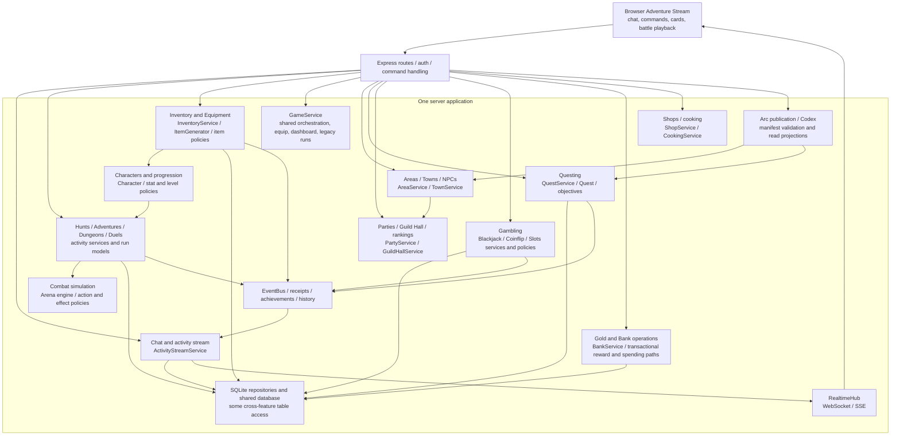
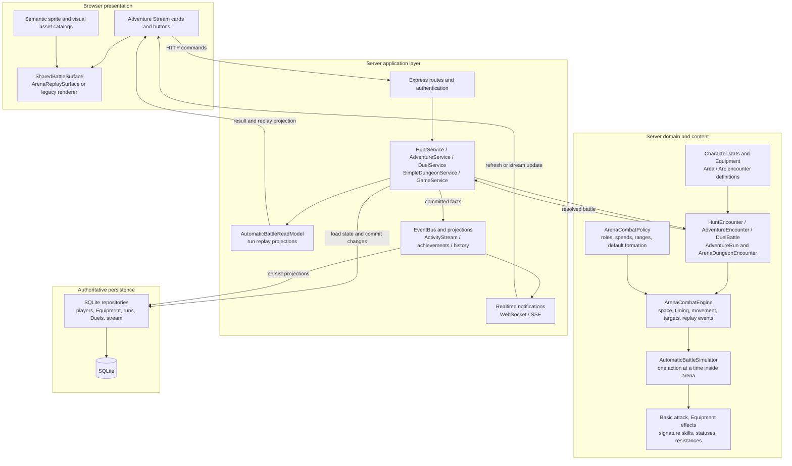
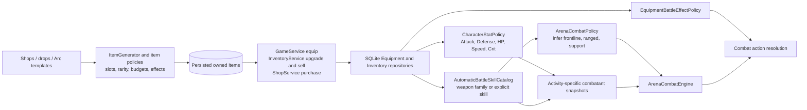

# Current combat and Equipment system map

Code inspection of the main baseline on 2026-10-05, before the concurrent arena-parity implementation. This describes that implementation, not the proposed overhaul. Owner-approved ongoing practice is in [SYSTEM_BOUNDARIES.md](SYSTEM_BOUNDARIES.md). No runtime behavior was changed for this map.

## Whole-application context

The combat diagrams below are a subsystem zoom, not the entire server domain. Existing functional areas are shown here. Boxes group current responsibilities; they are not claims of strictly enforced module APIs, dedicated databases, or separate deployments. Solid arrows illustrate selected current interactions, not an exhaustive call graph.

### Existing separation versus missing enforcement

- Questing has its own service, domain models/objectives, catalog, and repository. It is not implemented inside combat. Progress/rewards integrate with shared player/progression state.
- Blackjack, Coinflip, and Slots each have services, policies, and repositories. Their repositories also modify the shared carried-Gold column as part of transactional settlement. This provides atomicity but couples them to wallet storage.
- Gold has Bank operations and several transactional reward/spend paths, not one exclusive wallet module/API. A shared in-transaction balance operation would improve consistency without splitting wager settlement from payment.
- Party membership/readiness has a domain model and service; storage uses the broad game repository. Guild Hall has a service composing simulated-adventurer population, profiles, ranking, and history. This is not evidence of a full player-created guild system with membership/ranks/treasury.
- Chat message validation/persistence and game-receipt projection coexist in `ActivityStreamService`. Both share an ordered stream and transport. A chat service and receipt projectors could own their inputs separately while using the same stream storage.
- Characters, Equipment, and combat are separate files/policies, but combat consumes item-shaped data and infers role from skills. A stable combatant/loadout snapshot would make the integration boundary clearer.
- `GameService` and `SQLiteGameRepository` span multiple features. Dedicated services exist, but their existence alone does not prove encapsulation. Some application services instantiate concrete SQLite repositories and several repositories touch shared tables.

### Architectural interpretation

There are two independent dimensions: technical layers (presentation, application, domain, persistence) and functional modules (Items, Combat, Quests, Economy, Chat, etc.). The repository mostly organizes folders by technical layer, with feature-specific files inside each. For independent feature work, module ownership and explicit contracts matter more than folder names. Keep the modular monolith, strengthen the seams that affect actual changes, and avoid adding a universal mediator that knows every feature.

The recommended boundary from Items to Combat is a data projection: owned/equipped items -> derived combat loadout -> immutable combatant snapshot -> simulation. Combat needs capabilities, not inventory ownership, purchasing, selling, or database access. Gameplay outcomes go back to application orchestration, which coordinates rewards/progression and atomic persistence. Chat observes committed facts to produce receipts; it does not own quests, wagers, or fights.

General architectural references: [Service Layer](https://martinfowler.com/eaaCatalog/serviceLayer.html) describes coordinating application operations; [Bounded Context](https://martinfowler.com/bliki/BoundedContext.html) describes dividing domain models with explicit relationships. These principles support clearer internal contracts; they do not require a separate process for every feature.

## Command, authority, and replay flow

Arrows show calls or data flow, not separate deployments. All server components are part of the modular monolith. Persistence paths vary by activity; repositories below are grouped rather than a single universal transaction API.

The browser never decides live outcomes. A replay carries committed events/resources/positions; viewing controls affect presentation. The Arena Lab is an exception outside this flow: it uses `frontend/src/battle/arenaCombatPrototype.js` in the browser, with its own fixed roster and renderer, without saving progression or granting rewards.

## How Equipment reaches combat today

Role inference occurs as the engine prepares combatants. The diagram splits this out to show its dependency on skill definitions; there is no standalone persisted loadout-role system today. Equipping is handled by `GameService`, not `InventoryService`. Current Attack includes the Weapon bonus, while other stats aggregate equipped item bonuses. One Speed stat supplies separate attack/movement mappings. The prototype's sliders are not live character stats.

## Boundary assessment

| Component | Current separation | Implication for independent improvement |
| --- | --- | --- |
| HTTP and application services | Services coordinate activity-specific commands; domain functions resolve rules. | Keep this boundary. A combat renderer change need not change routes or rewards. |
| Spatial simulation | Shared server engine across live encounter kinds. | Movement/pathing can be improved centrally, but regress every activity and existing replay consumers. |
| Combat action resolution | Arena engine creates an `AutomaticBattleSimulator` for each action, supplies actor/target selection, and carries prior turns. | It reuses rules, but action resolution is still wrapped in a simulator interface. A focused action resolver would be a cleaner seam if the overhaul requires changes here. Preserve compatibility while extracting it. |
| Loadout, skills, and roles | Stats and effects have policies; role inference inspects the first skill's healing/Mana/support fields and weapon family. | Coupled: changing a support skill can change spatial behavior. Define a canonical combat-loadout projection with explicit role/basic action/range/skill before Equipment and AI evolve independently. |
| Encounter adapters | Hunt, Adventure, Duel, and Dungeon assemble their own combatant snapshots. | Keep activity-specific HP/reward rules, but audit shared fields so new healing power/basic actions are not lost on one path. Share normalization only where it removes real duplication. |
| Items and economy | Generation, slots, rarity, upgrade/sell, and effects have separate policies. Arc templates share generation validation/budgets. | Good starting seam; an item overhaul still affects Shops, drops, upgrades, persistence, Arc validation, and previews through their item contract. |
| Services and persistence | SQLite repositories own storage; some services construct concrete SQLite repositories using `repository.db`. | Authority is separated from UI, but application code is not fully independent of SQLite. Prefer constructor injection when touching these services; do not introduce infrastructure abstractions solely for ceremony. |
| Replay data | Engine emits a versioned arena replay; read models preserve legacy formats. | Strong seam for animation work: renderer can improve without changing outcomes if the replay carries sufficient event data. Version or extend the contract when fields are missing. |
| Playback and rendering | `ArenaReplaySurface` in `SharedBattleSurface.jsx` owns cursor/speed, event reconstruction, resource display, positioning, and markup. | Coupled inside presentation. Separate a replay clock, replay state adapter, and arena rendering/effects so timing and animations can be improved/tested individually. |
| Prototype and live presentation | Separate simulators/renderers. Live renderer compresses playback and omits much prototype choreography. | Prototype success is not live parity. Compare the same behavior explicitly and reuse presentation pieces where useful; never promote browser simulation into live authority. |
| Formation | Domain accepts/validates placements and supplies defaults; live services use default deployment. | Player formation is an end-to-end feature, not just a UI addition: command ownership, persistence, readiness, encounter snapshots, and UI all need a shared contract. |
| Events and realtime | Committed facts drive stream/history/notifications. | Preserve projections as outputs. Do not move combat decisions into WebSocket handlers or stream rendering. |

## Practical work boundaries for the approved overhaul

These are recommended internal modules/contracts, not microservices or an assertion that all exist today:

1. **Item and combat-loadout contract:** owned Equipment -> canonical stats, role, basic action, range, skill, effects. Establish this first because balance, AI, adapters, and previews depend on it.
2. **Formation commands:** ownership/readiness/legal placements -> persisted encounter formation. Can use default formation while player controls are developed.
3. **Spatial AI and timing:** canonical combatants + formation -> deterministic movement/action schedule. Keep rewards/economy outside it.
4. **Action rules and balance:** attack/heal/skill/status resolution -> authoritative state changes. Test without browser animation.
5. **Replay contract:** committed state changes -> immutable versioned playback events. Preserve old readers.
6. **Playback and animation:** replay + viewing preferences + semantic art -> visible fight. Test without rerunning simulation.
7. **Activity integration and transactions:** real encounter inputs -> commit combat, rewards, progression, and projections. Cover every activity and reconnect/retry behavior.

Individual improvement means stable contracts and focused tests, not complete isolation: changing role capabilities or item power necessarily requires integration/balance verification.

## Code references

- Composition/routes: `src/app.js`.
- Orchestration: `src/application/HuntService.js`, `AdventureService.js`, `DuelService.js`, `SimpleDungeonService.js`, `GameService.js`, `InventoryService.js`, `PartyService.js`.
- Spatial rules: `src/domain/ArenaCombatEngine.js`, `ArenaCombatPolicy.js`.
- Action rules: `src/domain/AutomaticBattleSimulator.js`, `AutomaticBattleSkillPolicy.js`, `AutomaticBattleSkillCatalog.js`, `EquipmentBattleEffectPolicy.js`, `AutomaticBattleEffectPolicy.js`.
- Loadout/items: `src/domain/Character.js`, `CharacterStatPolicy.js`, `ItemGenerator.js`, `ArcEquipmentTemplatePolicy.js`, `EquipmentSlotPolicy.js`, `RelicProgressionPolicy.js`.
- Projection: `src/application/AutomaticBattleReadModel.js`, `ActivityStreamService.js`, run replay construction in `GameService.js`.
- Browser: `frontend/src/components/chat/AdventureStream.jsx`, `SharedBattleSurface.jsx`, `frontend/src/battle/sharedReplay.js`.
- Comparison lab: `frontend/src/ArenaCombatPrototypeApp.jsx`, `frontend/src/battle/arenaCombatPrototype.js`.

This was a code-level architecture review; no gameplay tests or fresh visual-parity validation were run for the documentation change.
